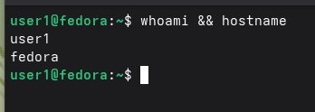

Мы запустили vmware и создали в нем ВМ со следующими параметрами:    

Подключили установочный образ Fedora 44 и сняли снимок состояния.    

  

Вопрос 1)Чтобы в случае поломки во время установки можно было откатиться на момент до нее. 

Запустили машину.Выставили язык, раскладку, часовой пояс(это уже после установки).   

 Выбрать ручной режим разметки диска было нельзя. Там мог быть вариант Custom, но его там не было. Для вм это приемлемо.    
 

Имя пользователя и устройства посмотрели в настройках, потому что при установке не спросили.  

Или вот это:

(не очень поняла просто)

Сняли второй снимок состояния

Вопрос 2)Можно потерять данные в случае реального компьютера, а не вм.Так как установщик стирает содержимое.
